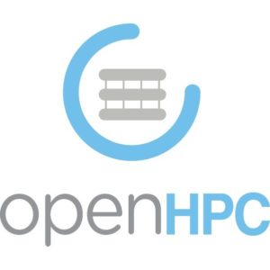
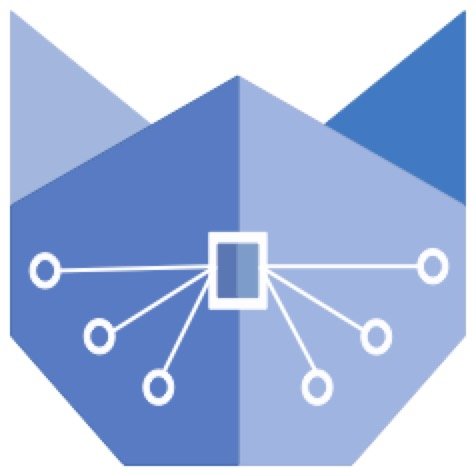
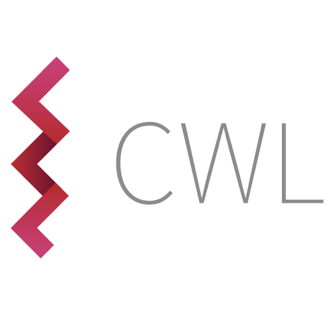

# Eugene de Beste

<u>Senior HPC Technologist</u>

<a href="mailto:eugene@debeste.co.za"><i class="fa fa-envelope"></i>eugene@debeste.co.za</a>
 
<a href="https://themeanti.me"><i class="fa fa-globe"></i>https://TheMeanTi.me</a>
 
<a href="https://www.linkedin.com/in/eugene-de-beste/"><i class="fa fa-linkedin"></i>LinkedIn Profile</a>
 
<a href="https://github.com/Banshee1221"><i class="fa fa-github"></i>GitHub Profile</a>

  
_"The right man in the wrong place can make all the difference in the world."_ 

- G-man, Half-Life 2.

## Current Role

Senior HPC Technologist based in the __Centre for High Performance Computing's (CHPC)__ __Advanced Computer Engineering (ACE)__ Lab with a primary focus on HPC education, cloud computing systems and distributed storage. The CHPC operates under the __National Integrated Cyber Infrastructure System (NICIS)__, which in turn falls under the umbrella of the __Council for Scientific and Industrial Research (CSIR)__ of South Africa.

### Responsibilities

- • __Cloud computing__ research and development, primarily focussing on OpenStack. Manage the OpenStack Research Cloud initiative, which aims to provide a test-bed platform for investigating OpenStack services and developing solutions on-top of OpenStack for the CHPC and CSIR.
- • Shape development and implementation of the CSIR Public cloud offering policies and assist with technical support.
- • __Distributed storage__ research and development, primarily focussing on CEPH. Manage and optimise the ACE CEPH cluster and investigate it's ability to serve as a tier 1 filesystem to compete with traditional High Performance Computing (HPC) filesystems.
- • Contributing to the international __Student Cluster Competition (SCC)__ initiative. The SCC aims to educate young South African tertiary education students in Linux and HPC. Duties include planning the event, educational video content creation, preparing tutorial tasks for students, providing students with cloud computing resources to train on, innovating on assignments and grading and preparing the online education management system.
- • Infrastructure procurement, management and maintenance, including maintenance of legacy OpenNebula cloud deployment.
- • Migration of legacy OpenNebula private cloud system to a standardised OpenStack implementation.
- • Software system __innovations__, which include implementing monitoring and alerting for infrastructure, new hardware and inventory management systems, improvements to knowledge-base and general software stack innovations.
- • Supporting and training staff with software and infrastructure in the broader CSIR organisation. Duties include, but are not limited to, introducing staff to new concepts in software, assisting with programming and debugging software, training staff on cloud computing paradigms and software containers and more.
- • Support the South African Development Community (SADC) through the __HPC Ecosystems__ project (donation HPC equipment and training). Duties include liaison with Universities across Africa in order to deliver HPC donation equipment, educating recipients with HPC and Linux administration concepts and skills, contributing to OpenHPC training materials and implementing monitoring and reporting services.
- • Network configuration and debugging in the ACE Lab data center in order to facilitate new equipment being installed and to standardise network configurations to match upstream CSIR projects.
- • Automation engineering and bringing infrastructure in the ACE Lab into an infrastructure-as-code approach as to optimise efficiency and advise the broader CSIR on new and better paradigms for hardware and software management.
- • Introducing __containerisation__ for software development and porting legacy codebase and applications to Docker.
- • Introducing continuous delivery for software development and other __DevOps__ practices.
- • __Training__ of graduate staff. Duties include introducing graduate training staff to various concepts such as cloud computing, networking and HPC and providing hands-on scenarios for them to develop skills.
- • Supporting various business units with technical expertise on networking, cloud operations, and more.

## Technology Experience
### Non-exhaustive

  <figure>
    
    <figcaption>Terraform</figcaption>
  </figure>
  <figure>
    
    <figcaption>Ansible</figcaption>
  </figure>
  <figure>
    
    <figcaption>Prometheus</figcaption>
  </figure>
  <figure>
    
    <figcaption>Python</figcaption>
  </figure>
  <figure>
    
    <figcaption>BASH</figcaption>
  </figure>
  <figure>
    
    <figcaption>OpenHPC</figcaption>
  </figure>
  <figure>
    
    <figcaption>Vault</figcaption>
  </figure>

  <figure>
    
    <figcaption>Docker</figcaption>
  </figure>
  <figure>
    
    <figcaption id="singularity">Singularity</figcaption>
  </figure>
  <figure>
    
    <figcaption>KVM</figcaption>
  </figure>
  <figure>
    
    <figcaption>OpenStack</figcaption>
  </figure>
  <figure>
    
    <figcaption>CEPH</figcaption>
  </figure>
  <figure>
    
    <figcaption>CentOS</figcaption>
  </figure>
  <figure>
    
    <figcaption>Ubuntu</figcaption>
  </figure>

  <figure>
    
    <figcaption>Git</figcaption>
  </figure>
  <figure>
    
    <figcaption>xCAT</figcaption>
  </figure>
  <figure>
    
    <figcaption>MAAS</figcaption>
  </figure>
  <figure>
    
    <figcaption>OpenStack Kolla</figcaption>
  </figure>
  <figure>
    
    <figcaption>pfSense</figcaption>
  </figure>
  <figure>
    
    <figcaption>SLURM</figcaption>
  </figure>
  <figure>
    
    <figcaption>Grafana</figcaption>
  </figure>

  <figure>
    
    <figcaption>OpenNebula</figcaption>
  </figure>
  <figure>
    
    <figcaption>FreeIPA</figcaption>
  </figure>
  <figure>
    
    <figcaption>Jupyter</figcaption>
  </figure>
  <figure>
    
    <figcaption>HTML5, CSS & JS</figcaption>
  </figure>
  <figure>
    
    <figcaption>Common Workflow Language</figcaption>
  </figure>
  <figure>
    
    <figcaption>Travis-CI</figcaption>
  </figure>
  <figure>
    
    <figcaption>GitLab CI/CD</figcaption>
  </figure>

  <figure>
    
    <figcaption>Nginx</figcaption>
  </figure>
  <figure>
    
    <figcaption>Let's Encrypt</figcaption>
  </figure>

## Special Projects
___NB: Details of projects listed here are reduced in [work experience](#professional-work-experience) section below to remove redundancies.___
- __• CHPC__ = Centre for High Performance Computing, South Africa
- __• UCT__ = University of Cape Town
- __• SANBI__ = South African National Bioinformatics Institute
- __• HISP__ = Health Information Systems Program
- __• NICD__ = National Institute for Communicable Diseases
- __• ICS__ = Internet Communication Services
- __• NICD__ = National Institute for Communicable Diseases
- __• HPC__ = High Performance Computing
- __• UWC__ = University of the Western Cape

### HISP OpenStack Deployment Consulting
`CHPC`
- __(2022)__ HISP and the CHPC entered into an agreement for consulting on OpenStack cloud deployment. 
- Duties included:
- • Evaluation of existing hardware infrastructure and suggestion on how to best have it fit an OpenStack design.
- • Conceptual network design and layout for the OpenStack control plane and cloud network.
- • Configuration of aspects of network switching equipment: Configuring switchports ports for VLAN access, configuring MLAG on Mellanox switches.
- • Deployment of MAAS provisioning server and high-available configuration thereof.
- • Deploying the OpenStack platform using Kolla and Kolla-ansible.
- • Providing training and documentation to the team during and after the deployment.

### Student Cluster Competition
`CHPC`
- __(2020)__ Due to the coronavirus pandemic, the CHPC needed to move their student cluster competition online.
- Duties included:
- • The generation of many high-quality videos for the educational part of the competition, with topics such as memory, network interconnects, NUMA, CPU vectorisation, software containers, BASH tips and tricks and more.
- • Preparing content on the learning management system (Canvas).
- • Assisting students with tutorials.
- • Tutoring students in "office-hours" sessions.

### Ilifu project
`UCT/SANBI`
- __(2018 - 2020)__ _The ilifu project is currently being used in a production setting._
- The ilifu project is a data-intensive research cloud aimed at academic research work with specifics in astronomy and bioinformatics. It is a joint venture between multiple universities, as well as the Department of Science and Technology in South Africa. This project involved the planning, prototyping and deployment of an OpenStack based private cloud with a multi-petabyte CEPH cluster as its storage. 
- Duties included the following:
- • Planning of private cloud deployment with a team from UCT. This included the necessary hardware, network configuration and OpenStack services.
- • Development and implementation a prototype OpenStack instance on testing hardware. Experimentation of OpenStack services were conducted on this prototype implementation.
- • Research and implementation of CEPH distributed storage system with erasure coding to maximize available end-user storage space.
- • Development and implementation of production OpenStack private cloud utilising the aforementioned CEPH storage backend using the Kolla and Kolla-ansible deployment method.
- • Exploring and implementing OpenStack Manila to allow the use of the CEPH backend as a tier 1 filesystem for end-users of the cloud.
- • Consulting services and generalised second-tier technology support support for CEPH implementation.
- • Project details here: [http://www.ilifu.ac.za/](http://www.ilifu.ac.za/).

### HISP OpenStack Deployment Training
`SANBI`
- __(2019 - 2020)__ HISP and SANBI entered into an agreement for assistance with deploying an OpenStack cluster. 
- Duties included:
- • Introducing software containers and training HISP users on the topic.
- • Planning the hardware and network layout for HISP OpenStack by discussing needs and expectations for the cloud.
- • Planning the deployment of the OpenStack cloud and training the HISP IT staff on OpenStack deployment and usage.
- • Running multiple deployment scenarios with the HISP IT team and training them with hands-on deployment of OpenStack in a simulated lab.

### NICD HPC Deployment
`SANBI`
- __(2019 - 2020)__ The NICD requested assistance from SANBI to deploy an HPC software stack.
- Duties included:
- • Evaluating and understanding the NICD hardware configuration.
- • Deploying the HPC stack with SLURM and Singularity containers.
- • Deploying the Galaxy (bioinformatics) platform on top of the HPC software stack.
- • Training the IT staff of the NICD in order to maintain and improve the deployed software stack and provide new tools to users via Singularity containers.

### UWC HPC Deployment
`SANBI`
- __(2019 - 2020)__ UWC eResearch contacted SANBI to request help with deploying an HPC cluster.
- The goal of this project was to allow UWC to be able to offer common resources to researchers and students across departments in a unified research-first offering.
- Duties included:
- • Working with the Internet Communication Services (ICS) team to discuss and plan a hardware and software stack as well as the networking configuration for the cluster. This involved the re-use of older existing computer hardware that was donated to the project.
- • Deploying bare-metal servers using MAAS (highly available) to provision and manage the hardware.
- • Deploying the cluster software stack (SLURM based) using Ansible.
- • Providing support for the cluster software and hardware stacks.

## Professional Work Experience

### Job Roles

`2020-ongoing`
__<u>(Current) Senior High Performance Computing Technologist</u>__ --- _Advanced Computer Engineering Lab, Centre for High Performance Computing, Council for Scientific and Industrial Research_
  
- ___Refer to the [Responsibilities](#responsibilities) section in [Current Role](#current-role) above.___

 

`2018-2020`
__<u>External Consultant</u>__ --- _ILIFU Project, University of Cape Town_
- • Planning, development, implementation, consulting and support of a private cloud deployment for use primarily by astronomy and bioinformatics researchers.

`2017-2020`
__<u>Systems Developer</u>__ --- _South African National Bioinformatics Institute, University of the Western Cape_
- • Trained multiple teams of students to enter the Centre for High Performance Computing Student Cluster Competition, one of which proceeded to compete internationally at the International Supercomputing Conference's Student Cluster Challenge in 2017. ([Source.](https://www.uwc.ac.za/news-and-announcements/news/uwc-students-lead-team-sa-in-2017-international-supercomputing-competition-823))
- • Migration of in-house developed VM management software to OpenStack Cloud. This involved inventorying the fleet of bare-metal hosts and VMs, deploying OpenStack using Kolla-ansible and migrating VMs to the new platform.
- • Provided training and assistance on the implementation of an OpenStack based cloud to the Health Information Systems Program (HISP) organisation.
- • Optimisation of CEPH storage performance by correcting inefficient legacy configuration, upgrading to latest releases and re-balancing data distribution of CEPH cluster.
- • Provided CEPH as a filesystem to High Performance Computing (HPC) users. This allowed for the management of one single filesystem that could be used for both end-users as well as administrators.
- • Implemented the software stack for an HPC cluster and Galaxy server at the National Institute for Communicable Diseases (NICD) in Johannesburg.
- • Assisted the University of the Western Cape (UWC) Internet Communication Services (ICS) team with deployment of an HPC cluster for UWC eResearch HPC offering.
- • Containerised (Docker) many system and administrative services in order to optimise the efficiency of IT staff.
- • Containerised (Singularity) many bioinformatics scientific user applications, creating a substantially simpler way for SANBI to package and deploy software applications with complicated and/or conflicting software dependencies for their HPC cluster.
- • Migrated from legacy system of manual infrastructure deployment with automated infrastructure deployments utilising MAAS and PXE.
- • Implemented infrastructure-as-code approach with Ansible and Terraform for IT management and up-skilled development staff to utilise these tools to reduce their development and testing time.
- • Implemented pfSense firewall to migrate legacy system which involved reworking SANBI networking configuration.
- • Deployed HPC clusters in cloud and on bare-metal (with focus on the SLURM scheduler.).
- • Wrote many Ansible roles and playbooks for automated deployment of various internal systems including HPC clusters, administrative services and more.
- • Migrated legacy authentication LDAP system to FreeIPA.
- • Implemented monitoring and alerting automation with Prometheus, Grafana and alertmanager in order to preemptively catch and solve infrastructure issues.
- • Managed IT infrastructure for academic researchers, including provisioning of virtual and physical resources for computational activities.
- • Provided IT consulting and advanced support to end-users, academic staff and development staff.
- • Procurement for various projects, ranging from user laptops to high performance servers and switching equipment.
- • Established change management control for IT staff and knowledge repositories for both end-users and IT staff.
- • Network debugging and tracing (VLANs, Openvswitch, port mappings).
- • Optimised and improved security for IT staff.
- • Implementation of a helpdesk ticketing system for IT staff to track user issues and generate reports.

`2015-2016`
__<u>Systems Administrator Intern</u>__ --- _VOSS Solutions_
- • Upgrading production service software from source.
- • VMWare management - Network tracing and VLAN tagging configuration.
- • Debugging issues related to removable storage passthrough to virtual machines on VMWare ESXI.
- • AD, DNS and WSUS management.
- • User management on Cisco ASA devices.
- • User management on Linux devices.
- • Gathering quotes and creating purchase orders.
- • Desktop support for employees (Operating system installs, software troubleshooting, etc.).

`2013-2014`
__<u>Computer Laboratory Administrator</u>__ --- _University of the Western Cape_
- • Ansible for managing fleet of computers.
- • Managed Linux operating system installations.
- • Network configuration for lab.
- • Provide equipment for use by researchers.
- • Prepare lab for use by computer science students during networking practicals.
- • Fixed physical broken computers.
- • Built website for South African Sign Language university project.

### Volunteering Roles

`2017-2018`
__<u>Volunteer Staff</u>__ --- _BSides Cape Town_
- Assisted with preparation for the event as well as operation during the event.

`2017-2018`
__<u>Volunteer Staff</u>__ --- _DevOpsDays Cape Town_
- Assisted with preparation for the event as well as operation during the event.

`2018`
<strong class="page-breaker"><u>Tutor</u></strong> --- _JEDI Workshop, Madagascar_ ([Source.](https://themeanti.me/technology/2018/06/27/cwl_pipeline_astro.html))
- Trained students in the following:
- • Navigating and using Jupyter notebooks.
- • Using Bash, navigating Linux and running scripts.
- • Using Docker and Singularity containers (creation and use).
- • Utilising Jupyter and software containers to develop reproducible scientific data processing pipelines in an astronomy focussed context.

`2017`
__<u>Tutor</u>__ --- _Software Carpentry, Observatory_
- Assisted in tutoring researchers in Bash, Python and Git at the Software Carpentry meeting during PyCon 2017.

`2016`
__<u>Hackathon Participant</u>__ --- _H3ABioNet Cloud computing hackathon, University of Pretoria_ ([Source.](https://www.h3abionet.org/categories/training/h3abionet-cloud-computing-hackathon))
- Co-developed the Nextflow implementation of the H3Agwas pipeline for H3ABioNet. This involved Dockerising tools that the pipeline required and bringing them into use for Nextflow. [GitHub Repository here.](https://github.com/h3abionet/h3agwas#8-acknowledgement-copyright-and-general)

`2014`
__<u>Tutor</u>__ --- _Software Carpentry, University of Cape Town_ ([Source.](https://software-carpentry.org/blog/2014/12/cape-town-swc.html))
- Assisted in tutoring researchers in Bash, Python and Git at the Software Carpentry meeting at the University of Cape Town.

`2012-2013`
__<u>Volunteer Technical Assistant</u>__ --- _University of the Western Cape_
- Assisted with managing a computer laboratory for Computer Literacy. Duties included operating system installation, hardware repair and other administrative duties.

## Education

### Tertiary Education

`2016-2019`
__<u>M.Sc. Bioinformatics</u>__ --- _South African National Bioinformatics Institute_, _University of the Western Cape_
- Awarded _Cum Laude_.

`2015`
__<u>B.Sc. Hons Information Technology</u>__ --- _University of Cape Town_
- • Mini-thesis: __de Beste, E__., Stewart, G. and Gain, J. (2015). PyTeacher: Determining the Usefulness of Visual Learning for Computer Science.
- • Built a League of Legends statistics analysis platform for class on Visual Thinking and Visualisation. ([Source.](https://people.cs.uct.ac.za/~mkuttel/VISProjects2015/FINAL_DBSEUG001_VIS2015/index.html))
- • Awarded B.Sc. Hons in Information Technology _Cum Laude_.

`2012-2014`
__<u>B.Sc. Computer Science</u>__ --- _University of the Western Cape_
- Awarded B.Sc. Computer Science _Cum Laude_.

### Secondary Education
`2007-2011`
__<u>National Senior Certificate</u>__ --- Fairbairn College

## Academic Outputs

### Journal Publications

`2018`
Ahmed, A.E., Mpangase, P.T., Panji, S., Baichoo, S., Souilmi, Y., Fadlelmola, F.M., Alghali, M., Aron, S., Bendou, H., __de Beste, E__. and Mbiyavanga, M. (2018). "_Organizing and running bioinformatics hackathons within Africa: The H3ABioNet cloud computing experience_". AAS open research, 1. ([Source.](https://aasopenresearch.org/articles/1-9))

### Thesis (M.Sc)

`2019`
__de Beste, E__. (2019). "_Enabling the processing of bioinformatics workflows where data is located through the use of cloud and container technologies_". ([Source.](static/education/msc_thesis.pdf))

### Posters

`2017`
__de Beste, E__., van Heusden, P., Christoffels, A., Bagula, A. (2017). "_Moving Workfows to Data_". __ISCB Africa ASBCB Conference on Bioinformatics__. ([Source.](/static/education/moving-worflow-to-data_poster.jpg))

`2019`
__de Beste, E__., Christoffels, A., van Heusden, P. (2019). "_Leveraging Open Source Technologies to Rapidly Deploy Infrastructure with Minimum Human Capacity_". __Centre for High Performance Computing Annual Conference__. ([Source.](/static/education/open-source-HPC-infra.jpeg))

## Conferences

`2013`
- __<u>Centre for High Performance Computing Annual Conference</u>__ --- _Cape Town, South Africa_
- Participated in the local CHPC Student Cluster Competition. Achieved first place.

`2014`
- __<u>International Supercomputing Conference</u>__ --- _Leipzig, Germany_
- Participated in the international Student Cluster Challenge. Achieved first overall prize.
- __<u>Software Carpentry UCT</u>__ --- _Cape Town, South Africa_
- Tutored researchers and interested parties in scientific computing with BASH and Python.

`2016`
- __<u>Centre for High Performance Computing Annual Conference</u>__ --- _East London, South Africa_
- Mentored a team of students from the University of the Western Cape to compete in the 2016 local Student Cluster Competition. This team achieved first place.

`2017`
- __<u>Software Carpentry PyCon</u>__ --- _Cape Town, South Africa_
- Teaching assistant and tutor for scientific computing to researchers and interested parties.
- __<u>BSides Cape Town</u>__ --- _Cape Town, South Africa_
- Volunteered as staff for organising the event and doing duties on-floor such as coordination, audio-visual and more.
- __<u>ISCB Africa ASBCB Conference on Bioinformatics</u>__ --- _Entebbe, Uganda_
- Presented a poster on "_Moving Workfows to Data_". Refer to above [poster section](#posters).
- __<u>Global Emerging Pathogens Treatment Consortium (GET) workshop on Data Management Design and LIMS Usage</u>__ --- _Freetown, Sierra Leone_
- Presented work on my MSc. thesis, cloud and container technologies for bioinformatics.
- __<u>DevOpsDays Cape Town</u>__ --- _Cape Town, South Africa_
- Volunteered as staff for organising the event and doing duties on-floor such as coordination, audio-visual and more.

`2018`
- __<u>JEDI Workship and Conference</u>__ --- _Madagascar_
- Lead workshop for a group of students on reproducible science using software containers and pipeline/workflow language tools, specifically Singularity and the Common Workflow Language. 
- __<u>DevOpsDays Cape Town</u>__ --- _Cape Town, South Africa_
- Volunteered as staff for organising the event and doing duties on-floor such as coordination, audio-visual and more.
- __<u>BSides Cape Town</u>__ --- _Cape Town, South Africa_
- Volunteered as staff for organising the event and doing duties on-floor such as coordination, audio-visual and more.

`2019`
- __<u>DevOpsDays Cape Town</u>__ --- _Cape Town, South Africa_
- Volunteered as staff for organising the event and doing duties on-floor such as coordination, audio-visual and more.
- __<u>Supercomputing Conference</u>__ --- _Denver, Colorado, United States of America_
- Awarded opportunity to attend through the STEM-TREK program in collaboration with the CHPC due to the work that my employer at the time was doing in collaboration with the CHPC's HPC ecosystems project.
- __<u>Centre for High Performance Computing Annual Conference</u>__ --- _Johannesburg, South Africa_
- Presented a poster on "_Leveraging Open Source Technologies to Rapidly Deploy Infrastructure with Minimum Human Capacity_". Refer to above [poster section](#posters).

## Achievements

`2018`
__<u>BSides Cape Town - Rite of Passage</u>__ --- _Las Vegas, United States of America_
- I was selected to attend DefCon (a cyber-security conference) 2018 in Las Vegas, as part of the __BSides Cape Town__ "_Rite of Passage_" event. This was as a result of my volunteering work at said event. The program has me working on-the-floor at the BSides Las Vegas event. I managed recordings of the event, showing people to their conference venues and general management duties. After BSides Las Vegas, I was given access to DefCon where I attended numberous talks and demonstrations by elite hackers in the cyber-security sphere.

`2014`
__<u>First Place Overall Prize for the ISC’14 Student Cluster Challenge</u>__ --- _International Supercomputing Conference, Leipzig, Germany_
- The ISC Student Cluster Challenge is a multi-faceted competition that pits students from universities across the world together in order to design and implement high performance computing clusters on both hardware and software fronts. Students are tasked with building and optimising a networked compute cluster and running various scientific tools and benchmarks in order to achieve the most accurate or fastest results. My team and I finished first place in the International Supercomputing Conference Student Cluster Challenge in Germany.

__<u>Top 3 Academic Achiever in Third Year (undergraduate)</u>__ --- _University of the Western Cape_ ([Source.](https://media-exp1.licdn.com/dms/image/C562DAQF1PwGgyVRBow/profile-treasury-image-shrink_1280_1280/0/1598201365987?e=1624431600&v=beta&t=cbWMyF6RHlTxYHcm12V9SkZ7BTQNWZqx-vuvmxogiYI))
- Achieved third top student in the third year of the Computer Science bachelors degree at the University of the Western Cape.

`2013`
__<u>First Place for the CHPC Student Cluster Competition 2013</u>__ --- _Centre for High Performance Computing, Council for Scientific and Industrial Research_
- Placed first in the Centre for High Performance Computing (CHPC) Student Cluster Competition. The CHPC run a competition that is a smaller scale version of the ISC Student Cluster Challenge, mentioned above. Students go through two phases of competition: The first is systems administration and Linux training and the second round is competing with a cluster that is designed by each team.

__<u>IBM Master the Mainframe Competition</u>__ --- _University of the Western Cape_
- IBM run an annual competition in which they introduce students to their "System z" platform. The goal is to educate students to leave them with hands-on and marketable skills in operating mainframe computing environments. I competed and completed the first phase of the competition.

`2012`
__<u>Golden Key Society</u>__ --- _University of the Western Cape_
- Invited to join the Golden Key International Honour Society. This is a program that aims to be made available to high academic achievers and provides them with experience and work opportunities, scholarships and more.

__<u>Top 5 Academic Achiever in First Year (undergraduate)</u>__ --- _University of the Western Cape_ ([Source.](https://media-exp1.licdn.com/dms/image/C562DAQHLdAmW8PyWeQ/profile-treasury-image-shrink_1280_1280/0/1602111872959?e=1624431600&v=beta&t=6ywBa4z_Llz8MwssXyhZb68v0ztUz5mYOFJhO1p_XV0))
- Achieved placement in the top five best performers in the first year of the Computer Science bachelors degree at the University of the Western Cape.

## Occupation

Cape Town, South Africa

The Mother City 

<!-- ### Footer

Last updated: June 2021 -->
